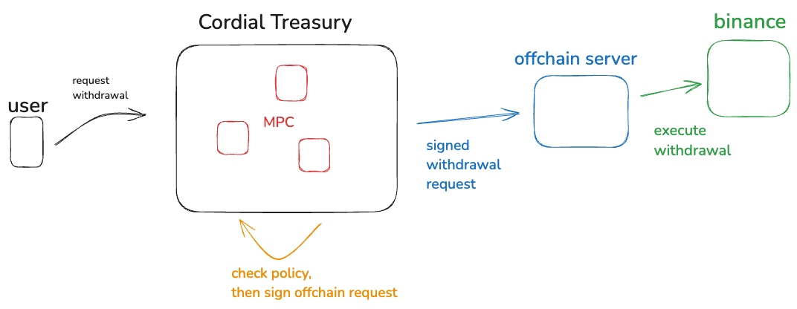

# Offchain

Offchain is a server that consolidates API keys in a central, secure location, and presents
a universal API that can be used to manage funds. This is intended for making withdrawals,
sub-account transfers, and deposits. Trading is out of scope.

Being able to withdraw funds directly from an exchange is a very sensitive operation. If you
withdraw to the wrong address, those funds could be lost forever. This necessitates a separate
application to take 'custody' of withdrawal-permissioned API keys.

### Features

- Simple configuration
- Single binary
- Rich exchange support and incredibly lightweight framework to easily add more
- Strong authentication using ed25519 based [http-signatures](https://datatracker.ietf.org/doc/html/rfc9421).
- Stateless
- Universal asset symbology (based on Cordial Systems asset registry)
- Can store exchange API keys in popular secret managers (vault, gcp, aws, etc).
- Ability exchange exchange operations on CLI.
- [Stable OpenAPI API](https://cordialapis.stoplight.io/docs/Exchange/2gnp0107q21eh-exchange)

# Install

```bash
go install github.com/cordialsys/offchain
```

# Usage

First, configure API keys for supported exchanges.

```yaml
# config.yaml
offchain:
  # setup API keys for the exchanges
  exchanges:
    binance:
      # load from your favorite secret manager
      api_key: "gcp:your_gcp_project,API_KEY_NAME"
      secret_key: "gcp:your_gcp_project,API_SECRET_NAME"
      # include any sub-accounts
      subaccounts:
        - id: "offchain1@example.com"
          api_key: "gcp:your_gcp_project,SUB1_API_KEY_NAME"
          secret_key: "gcp:your_gcp_project,SUB1_API_KEY_SECRET_NAME"
        # ...
```

API keys can be loaded from env, file, or from you favorite secret manager (see `oc secret --help`).

Second, generate a ed25519 key to authenticate to the `offchain` server. [HTTP Signatures](https://datatracker.ietf.org/doc/html/rfc9421)
are used.

You can generate a client-side key like so (private key will be written to disk).

```bash
oc keys generate mykey
# client-keys/mykey
# e7a205bbe21184f4f6cd72e7ba659566d96b8aea00e49b9967328b0109f9c706
```

Now update your server configuration again with the public key.

```yaml
offchain:
  server:
    public_keys:
      - id: "mykey"
        key: "abf9649d7a0a7534cde49f12de47effd601e60a2258e51b5a257af9ef78e901f"
```

Start the server.

```bash
oc start --config ./config.yaml -v
```

Now make requests against it.

```bash
# Lookup main account balances
oc api balances --exchange binance --sign-with mykey

# Lookup balance of a sub-account
oc api balances --subaccount offchain1@example.com --exchange binance --sign-with mykey

# Make sub-account transfer from main to sub-account
oc api --exchange binance transfer --to offchain1@example.com  --symbol USDC --amount 3 --sign-with mykey
# From sub-account to main
oc api --exchange binance transfer --from offchain1@example.com  --symbol USDC --amount 2 --sign-with mykey

# Make a withdrawal from main account
oc api --exchange binance withdraw --to "<your-solana-address>" --network SOL --symbol USDC --sign-with mykey

# Look at withdrawal history
oc api --exchange binance history --sign-with mykey
```

# Policy

To further enhance the security, policies should be built on top of `offchain`. For example, you should check that
a withdrawal address is approved before signing a request to `offchain`.

[Cordial Treasury](https://cordialsystems.com/) integrates with `offchain` and includes rich Transfer policies. It is default deny,
and allows you to easily build allow-lists, notional transfer limits, and approval/quorom conditions.



Cordial Treasury will enforce policies, then sign requests to offchain using an MPC key. Both Cordial Treasury and offchain are non-custodial, self-hosted products.

# Supported Exchanges

Exchange clients are lightweight, pure go implementations. It's very easy to add support for new exchanges.

- Backpack
- Binance
- Binance US
- Bybit
- Okx

# API Reference

See the [API reference](https://cordialapis.stoplight.io/docs/Exchange/2gnp0107q21eh-exchange).

For http-authorization, you can look at or use the simple [http-signature package](./pkg/httpsignature/).

# Crosschain

We maintain a similar library, [crosschain](https://github.com/cordialsys/crosschain). It's like offchain,
but solely for blockchains. You can locally generate addresses and make transfers on many different blockchains (as well as manage staking).

You could use both `oc` and `xc` to fully rebalance and/or take custody of your portfolio across all different exchanges
and blockchain networks.

# Roadmap

### Universal asset symbols

We are still building out the universal asset integration. If you have interest in this, reach out to us at https://cordialsystems.com/contact
and we can escalate.
